<div align="center">

# 🏥 AI Health Analyzer

### Your personal health companion — powered by AI

Ever looked at a blood test report and thought "what do these numbers even mean?" Yeah, me too. That's exactly why I built this.

AI Health Analyzer takes your lab reports, vitals, symptoms, and health data — and turns them into something you can actually understand. It doesn't just show numbers. It tells you what's off, what's trending in the wrong direction, and what you might want to talk to your doctor about.

Think of it as that one medically-informed friend who actually reads your reports and explains things properly. Except this friend never sleeps and remembers everything.

</div>

<br />

<div align="center">

[](https://nextjs.org/)
[](https://www.typescriptlang.org/)
[](https://react.dev/)
[](https://tailwindcss.com/)
[](https://www.prisma.io/)
[](https://openai.com/)
[](https://www.mysql.com/)
[](./LICENSE)
[](./.github/workflows/ci.yml)

</div>

<br />

<p align="center">
  <a href="https://ai-health-analyzer-l6mul3.drytis.dev/"><strong>🌐 Live Demo</strong></a>
  &nbsp;&nbsp;·&nbsp;&nbsp;
  <a href="https://github.com/NafeesAhmedBhatti/AI-Health-Analyzer"><strong>📦 GitHub Repo</strong></a>
</p>

---

## 📸 Screenshots

<table>
  <tr>
    <td align="center"><b>Landing Page</b></td>
    <td align="center"><b>Login</b></td>
  </tr>
  <tr>
    <td>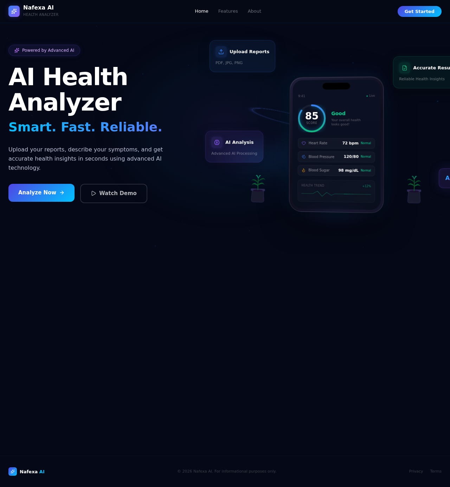</td>
    <td>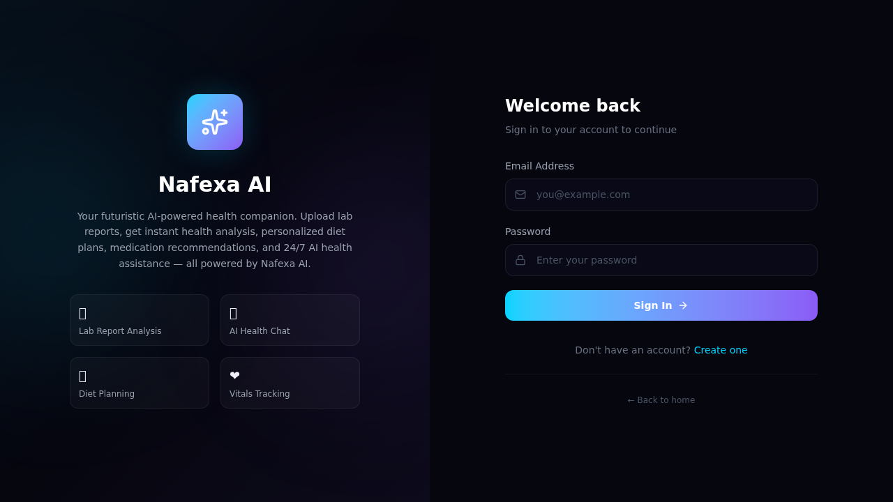</td>
  </tr>
  <tr>
    <td align="center"><b>Dashboard</b></td>
    <td align="center"><b>Lab Reports</b></td>
  </tr>
  <tr>
    <td>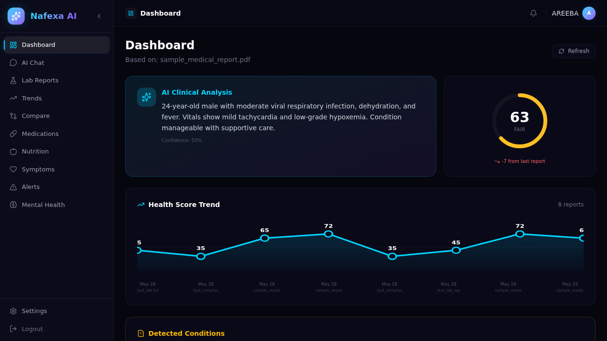</td>
    <td>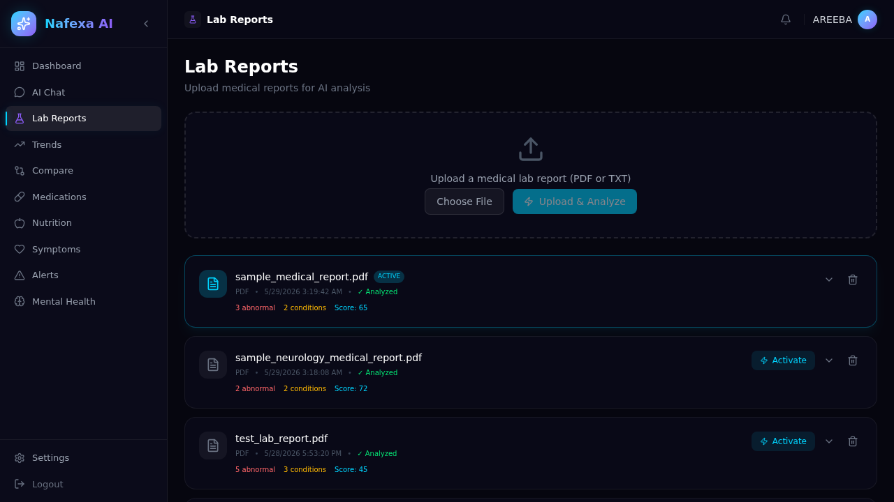</td>
  </tr>
  <tr>
    <td align="center"><b>Nafexa AI Nutrition</b></td>
    <td align="center"><b>AI Chat</b></td>
  </tr>
  <tr>
    <td>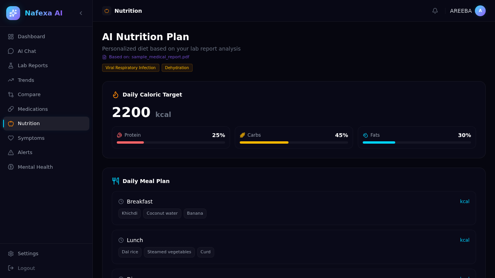</td>
    <td>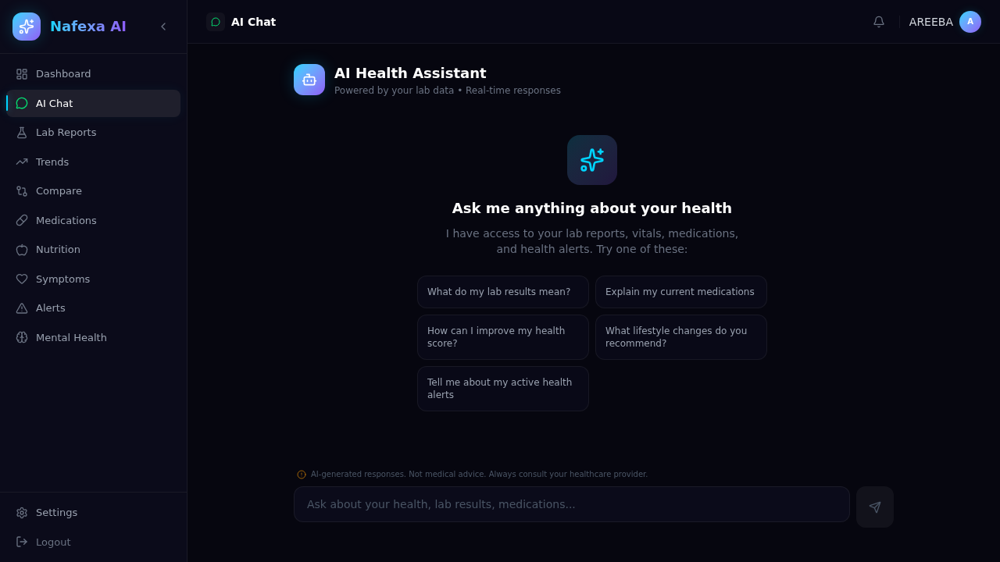</td>
  </tr>
  <tr>
    <td align="center"><b>Health Trends</b></td>
    <td align="center"><b>Mental Health</b></td>
  </tr>
  <tr>
    <td>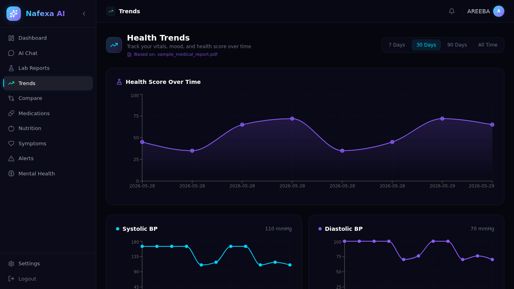</td>
    <td>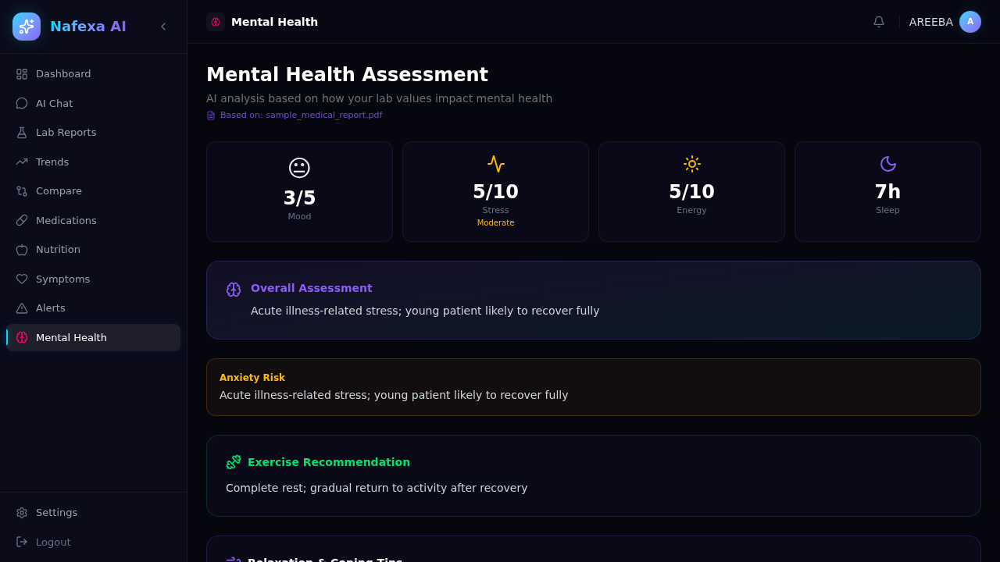</td>
  </tr>
  <tr>
    <td align="center"><b>Alerts</b></td>
    <td align="center"><b>Vitals</b></td>
  </tr>
  <tr>
    <td>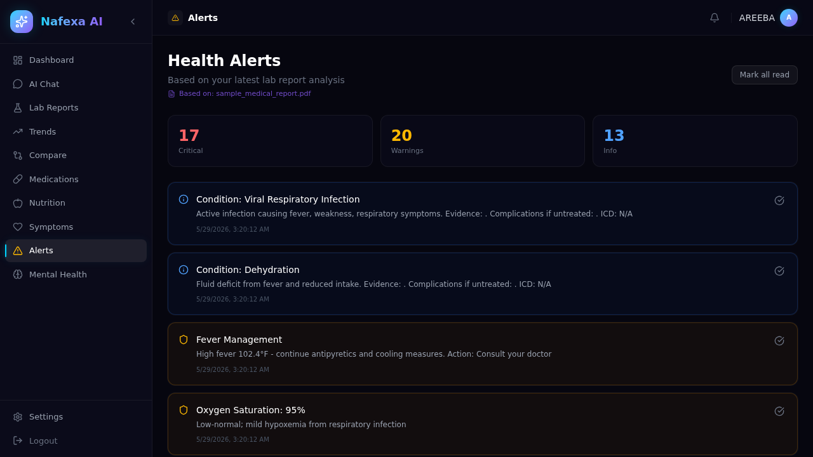</td>
    <td>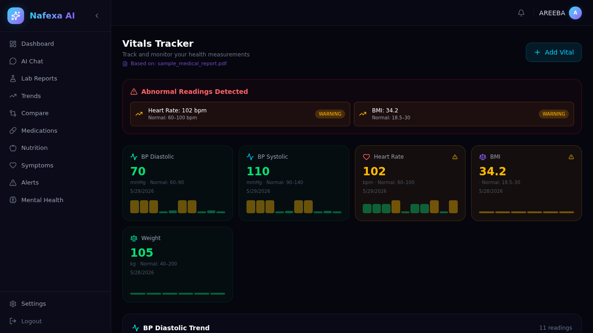</td>
  </tr>
  <tr>
    <td align="center"><b>Medications</b></td>
    <td align="center"><b>Mobile View</b></td>
  </tr>
  <tr>
    <td>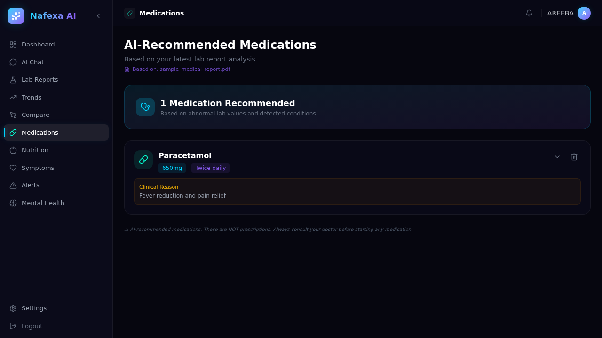</td>
    <td>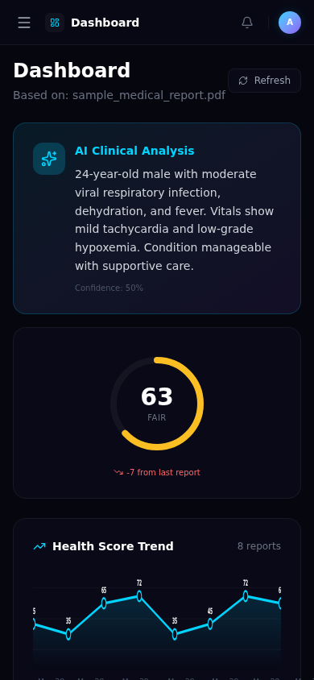</td>
  </tr>
</table>

---

## 🎯 Project Purpose

Let me be real here — health data is an absolute mess right now. You get a 3-page PDF from the lab, and it's nothing but reference codes and numbers that mean nothing unless you went to medical school. Your blood pressure readings are in one app. Your diet tracking is in another. Your mental health? Nobody even tracks that properly. And absolutely nothing ties all of this together into one coherent picture.

I built AI Health Analyzer because I was tired of this fragmentation. The whole point is to have one place where you upload your lab report and it actually tells you what's wrong. You log your vitals and it spots the trends you'd never catch manually. You describe your symptoms and it gives you a proper differential — not a diagnosis, but "here are the possibilities, here's how urgent each one is, and this one you should go see a doctor about today."

It's not trying to replace doctors. It's trying to make you understand your own health data so you can have better conversations with your doctor. There's a massive difference between walking into a clinic saying "I don't feel right" versus "my hemoglobin has dropped 15% over three months and my ferritin is below range." This app helps you get to that second place.

---

## ✨ Features

I didn't want to build yet another health tracker that just logs numbers and leaves you to figure out the rest. Every feature in this app has AI behind it because raw data without interpretation is basically useless. Here's what you actually get:

**Smart, not just pretty** — Every lab value, every vital reading, every symptom you log gets analyzed by AI. You're not just storing data, you're understanding it.

**Context-aware** — The AI doesn't give you generic advice. It knows your conditions, your medications, your vitals. When you ask it something, it answers based on your actual health data.

**Real-time** — AI chat and nutrition responses stream in as they're generated. No staring at a loading spinner for 30 seconds. It feels like talking to someone, not submitting a form.

**Actionable** — Every insight comes with a recommendation. Not "your blood sugar is 142" but "your fasting glucose has been above 126 for three consecutive readings — this indicates persistent hyperglycemia and you should discuss this with your physician."

**Family-ready** — One account, multiple health profiles. Track your parents' blood pressure, your kid's growth metrics, and your own lab reports — all separately, all in one place.

**You own your data** — Everything stays in your database. Nothing gets sent to third parties except the AI processing (which is stateless on OpenAI's end). You can export everything as PDF whenever you want.

---

## 🏥 Health Modules

The app is organized into 17 dedicated health modules, each one focused on a specific aspect of your health. Here's what each one does — the real version, not the marketing version:

**🔬 Lab Report Analyzer** — Upload any PDF lab report. The app extracts test names, values, units, and reference ranges. Then it highlights abnormal values, identifies potential conditions, calculates a health score, and gives you clinical recommendations. You can compare any two reports side by side with an AI-generated diff of what changed.

**📊 Health Score Dashboard** — A composite 0–100 score calculated from your lab values and vitals. It's not just "count normal things" — it's weighted by clinical significance. A slightly elevated liver enzyme means something different than slightly low vitamin D. The ring chart and trend graph show you where you stand and where you're heading.

**💓 Vitals Tracking** — Log heart rate, blood pressure (systolic/diastolic), SpO₂, body temperature, weight, and BMI. The app automatically flags abnormal readings and creates alerts if values keep trending in concerning directions.

**💊 Medication Management** — Track your medications with dosage, frequency, and timing. The AI cross-references them against your conditions and lab values, flags potential interactions, and suggests monitoring schedules.

**🤖 Nafexa AI Chat** — This is the heart of the app. A conversational health assistant that knows your actual data. Ask it "should I be worried about my blood pressure?" and it references your readings. Ask about side effects and it checks your medication list. Multi-turn conversations with context memory, streaming responses — feels like texting a knowledgeable friend.

**🥗 Nafexa AI Nutrition Expert** — A separate AI specialized in nutrition. It plans meals based on your actual health profile — if your blood sugar is elevated, it won't suggest a high-carb breakfast. Weekly meal plans with calorie targets, macro splits, and dietary reasoning.

**🩺 AI Symptom Checker** — Describe what's bothering you and get a ranked differential with confidence scores and urgency levels. It tells you straight up: "this needs immediate medical attention" or "this is likely benign but monitor for 48 hours." Triage, not diagnosis.

**🖼️ AI Skin Analysis** — Upload a photo of a skin concern and get a preliminary AI assessment with condition identification, confidence level, and urgency flag. It won't replace a dermatologist, but it can tell you whether to book an appointment this week or next month.

**🧠 Mental Health Tracker** — Log mood, anxiety, energy, and sleep quality daily. The app tracks these over time and correlates them with your lab values where relevant (because yes, things like vitamin B12, iron, and vitamin D directly affect your mood and energy). AI-generated coping strategies based on your patterns.

**👨‍👩‍👧 Family Health History** — Build a family health tree tracking hereditary conditions across generations. The AI calculates genetic risk factors — if diabetes runs in your family and your fasting glucose is trending up, that's a different risk profile than someone with no family history.

**👥 Family Member Profiles** — Separate health profiles for each family member. Their own vitals, medications, lab reports, and alerts — all managed from your single account with proper data isolation.

**🔔 Health Alerts** — Automatic, intelligent notifications. Not just "something is abnormal" — but categorized as critical (needs attention now), warning (trending wrong), or informational (something to keep an eye on). Alerts are generated from lab analysis, vitals trends, and AI assessments.

**📈 Health Trends & Analytics** — Interactive charts showing how your health score, vitals, and mental health metrics change over time. Spot patterns you'd never see in raw numbers — like your blood pressure consistently spiking on Mondays (work stress, maybe?).

**📋 Wellness Reports** — Generate downloadable PDF health reports with AI summaries. Your data, your doctor's language. Useful for actually bringing to appointments.

**⚖️ Report Comparison** — Pick any two lab reports and get a detailed side-by-side comparison. What improved, what got worse, what stayed the same, and what the AI thinks about the trajectory.

**⚙️ Settings & Preferences** — Customizable units (metric/imperial), notification preferences, AI model settings, and display options. Your app, your way.

**👤 Profile Management** — Keep your personal info, medical history, and emergency contacts in one place. The AI uses this context for more personalized insights.

---

## 🤖 AI Features

Everything AI in this app runs through GPT-4o, and I spent a ridiculous amount of time on the prompt engineering to make the responses actually useful. Here's the breakdown:

**Nafexa AI Health Chat** — This is the main conversational interface. It streams responses in real-time, maintains context across multi-turn conversations, and actually references your health data. When you ask "how's my heart doing?", it doesn't give you generic heart health tips — it pulls your blood pressure readings, checks your latest lipid panel, looks at your resting heart rate, and gives you a contextual answer. That's the difference between a chatbot and a health companion.

**Nafexa AI Nutrition Expert** — Separate specialized nutrition AI. It builds meal plans around your actual conditions, not generic calorie counting. High cholesterol? It adjusts. Prediabetic glucose readings? It accounts for that. It generates weekly schedules with specific meals, macro breakdowns, and the reasoning behind each suggestion.

**Lab Report AI Analysis** — When you upload a PDF, the app extracts the raw text, parses values against reference ranges, and then feeds everything to GPT-4o for clinical interpretation. The AI identifies abnormal values, suggests potential conditions, assesses severity, and provides recommendations. It even tries to correlate findings — like if your TSH is high and your vitamin D is low, it might suggest checking for autoimmune thyroid conditions.

**AI Symptom Assessment** — Differential diagnosis engine. You describe symptoms, it returns ranked possibilities with confidence scores, severity levels, and triage recommendations. It always includes appropriate medical disclaimers and tells you when to seek immediate care versus when monitoring is fine.

**AI Skin Analysis** — Image-based preliminary assessment. Upload a photo, the AI analyzes it, identifies possible conditions with confidence levels, and most importantly gives you an urgency flag — "see a dermatologist within a week" versus "schedule a routine check." Never a definitive diagnosis, always a recommendation.

**AI Mental Health Assessment** — Analyzes your mood entries, sleep patterns, and correlates them with lab values. Generates coping strategies, identifies concerning patterns (like steadily declining mood scores), and provides context-aware suggestions. It flags when professional help is recommended.

**AI Medication Recommendations** — Based on your detected conditions and lab values, the AI suggests medications with dosage ranges, common side effects, monitoring requirements, and interaction warnings. It cross-references with your current medication list to flag potential drug interactions.

**AI Nutrition Plan Generation** — Beyond the nutrition chat, the system generates structured weekly meal plans with calorie targets, macro splits (protein/carbs/fat), specific meal suggestions, and dietary reasoning tied to your health data.

**Streaming Response Architecture** — All AI responses use real-time streaming via ReadableStream. When you're chatting with Nafexa AI, you see the response build word by word — not a loading spinner followed by a wall of text. This was genuinely tricky to implement properly through Next.js route handlers.

---

## 🏗️ Architecture

Here's how the pieces fit together:

```
┌─────────────────────────────────────────────────────┐
│                      User                            │
│                  (Browser / Mobile)                   │
└──────────────────────┬──────────────────────────────┘
                       │
                       ▼
┌─────────────────────────────────────────────────────┐
│              Frontend (Next.js 16)                    │
│         React 19 · TypeScript · Tailwind CSS 4       │
│              Framer Motion · Recharts                 │
└──────────────────────┬──────────────────────────────┘
                       │ API Routes (Next.js App Router)
                       ▼
┌─────────────────────────────────────────────────────┐
│            Backend (Next.js API Routes)               │
│        NextAuth.js · Zod Validation · Prisma ORM     │
└──────────┬───────────────────────┬──────────────────┘
           │                       │
           ▼                       ▼
┌────────────────────┐  ┌─────────────────────────────┐
│   AI Services       │  │        Database              │
│   OpenAI API        │  │     MySQL 8.0 + Prisma       │
│   (Nafexa AI)       │  │   14 tables · 20+ indexes    │
│   · GPT-4o          │  │                               │
│   · Streaming       │  │                               │
│   · PDF Analysis    │  │                               │
│   · Image Analysis  │  │                               │
└────────────────────┘  └─────────────────────────────┘
```

The whole thing runs as a single Next.js application — the frontend and backend live together. No separate API server, no microservices, no unnecessary complexity. Next.js App Router handles server components for the UI and route handlers for the API. Authentication flows through NextAuth.js with JWT sessions. Every API request gets validated through Zod schemas before it touches the database. Prisma ORM handles all database operations with full type safety. And all AI features route through OpenAI's GPT-4o with streaming enabled.

It's intentionally simple. One app, one database, one AI provider. Less moving parts means fewer things that can break.

---

## 🛠️ Tech Stack

### Frontend

| Technology | Purpose | Why I chose it |
|-----------|---------|----------------|
| **Next.js 16** | Full-stack React framework (App Router) | Server components, API routes, file-based routing — everything in one place without a separate backend |
| **React 19** | UI library | Latest features, concurrent rendering, the ecosystem |
| **TypeScript** | Type-safe development (strict mode) | Catches bugs at compile time, not in production. Non-negotiable for a health data app |
| **Tailwind CSS 4** | Utility-first styling | Fast iteration, consistent design tokens, no CSS files with 500 lines nobody wants to maintain |
| **Framer Motion** | Animations & transitions | Smooth, purposeful motion that makes the dashboard feel alive without being distracting |
| **Recharts** | Interactive data visualization | Clean chart API, responsive, handles the health trends and score visualizations well |
| **Lucide React** | Icon library | Clean, consistent icons. Small bundle. Every icon looks like it belongs together |

### Backend

| Technology | Purpose | Why I chose it |
|-----------|---------|----------------|
| **Next.js API Routes** | Serverless API endpoints (24 routes) | Same deployment as the frontend, no separate server to manage, server-side rendering when needed |
| **Prisma ORM** | Type-safe database queries & migrations | Schema-first modeling, auto-generated types, migration management. Eliminates SQL injection by design |
| **NextAuth.js** | JWT-based authentication | Battle-tested auth for Next.js. Handles sessions, JWT signing, CSRF protection out of the box |
| **Zod** | Input validation & schema definitions | Runtime validation on every endpoint. If the data doesn't match the schema, it never reaches the database |
| **bcryptjs** | Password hashing (12 salt rounds) | Industry standard for password storage. 12 rounds is the sweet spot between security and performance |

### Database

| Technology | Purpose | Why I chose it |
|-----------|---------|----------------|
| **MySQL 8.0** | Relational database | Rock-solid, widely supported, handles relational health data well |
| **Prisma** | ORM with schema-first modeling | 14 tables with proper relations, indexes, and constraints all defined in one schema file |
| **14 Tables** | Users, vitals, symptoms, lab reports, medications, nutrition plans, mood entries, skin analyses, family history, alerts, reports, family members, health profiles, and more | Each table maps to a specific health domain with proper foreign keys and indexes |

### AI & Machine Learning

| Technology | Purpose | Why I chose it |
|-----------|---------|----------------|
| **OpenAI API (GPT-4o)** | LLM for health analysis, chat, and recommendations | Best-in-class for medical text interpretation and natural conversation. Handles complex multi-factor health analysis well |
| **Nafexa AI** | Custom AI health companion & nutrition expert | Specialized prompts and context injection that make the AI responses relevant to your actual data, not generic |
| **Streaming API** | Real-time AI response delivery | Nobody wants to wait 20 seconds for a response. Streaming makes AI feel conversational |
| **pdf-parse + unpdf** | PDF lab report extraction | Two parsers for reliability — some PDFs work better with one than the other |
| **jsPDF** | PDF health report generation | Generate downloadable wellness reports with AI commentary. Client-side generation, no server load |

### DevOps & Quality

| Technology | Purpose | Why I chose it |
|-----------|---------|----------------|
| **GitHub Actions** | CI pipeline (Lint → TypeCheck → Test → Build) | Automated quality gates on every push. If it doesn't pass, it doesn't merge |
| **Node.js 22** | Runtime environment | Latest LTS, best performance |
| **Jest** | Unit & integration testing | Battle-tested, great TypeScript support, snapshot testing for UI components |
| **Testing Library** | Component testing | Test behavior, not implementation. "Does this button work?" not "does this div have this class?" |
| **ESLint** | Code quality & linting | Catches the dumb mistakes before they become runtime bugs |

---

## 📂 Project Structure

```
AI-Health-Analyzer/
├── .github/
│   └── workflows/
│       └── ci.yml                  # GitHub Actions CI pipeline
├── prisma/
│   └── schema.prisma               # Database schema (14 models)
├── public/
│   ├── uploads/                    # User uploaded files
│   │   ├── skin/                   # Skin analysis images
│   │   ├── lab-reports/            # Uploaded lab report PDFs
│   │   └── reports/                # Generated PDF reports
│   └── videos/                     # Video assets
├── screenshots/                    # App screenshots for README
├── src/
│   ├── __tests__/                  # Unit & integration tests (Jest)
│   │   └── logic.test.ts           # Business logic tests
│   ├── app/
│   │   ├── (auth)/                 # Authentication pages
│   │   │   ├── login/page.tsx      # Login page
│   │   │   └── register/page.tsx   # Register page
│   │   ├── (dashboard)/            # Dashboard pages (17 modules)
│   │   │   ├── dashboard/
│   │   │   │   ├── page.tsx        # Main dashboard overview
│   │   │   │   ├── chat/           # Nafexa AI Chat
│   │   │   │   ├── lab-reports/    # Lab report management
│   │   │   │   ├── vitals/         # Vitals tracking
│   │   │   │   ├── medications/    # Medication management
│   │   │   │   ├── nutrition/      # Nutrition & diet planner
│   │   │   │   ├── mental-health/  # Mental health tracker
│   │   │   │   ├── symptoms/       # AI symptom checker
│   │   │   │   ├── skin/           # AI skin analysis
│   │   │   │   ├── trends/         # Health trends & analytics
│   │   │   │   ├── compare/        # Report comparison
│   │   │   │   ├── family-history/ # Family health tree
│   │   │   │   ├── alerts/         # Health alerts
│   │   │   │   ├── reports/        # PDF report generation
│   │   │   │   ├── family/         # Family member profiles
│   │   │   │   ├── profile/        # User profile
│   │   │   │   └── settings/       # User settings
│   │   │   ├── layout.tsx          # Dashboard layout + sidebar
│   │   │   └── error.tsx           # Error boundary
│   │   ├── api/                    # API routes (24 endpoints)
│   │   │   ├── auth/               # NextAuth (login/session)
│   │   │   ├── auth/register/      # User registration
│   │   │   ├── chat/               # AI chat (streaming)
│   │   │   ├── dashboard/          # Dashboard aggregated data
│   │   │   ├── lab-reports/        # Lab report list & create
│   │   │   ├── lab-reports/upload/ # PDF upload + AI analysis
│   │   │   ├── lab-reports/[id]/activate/ # Activate report
│   │   │   ├── nutrition/          # Nutrition plans CRUD
│   │   │   ├── nutrition-chat/     # Nafexa AI nutrition expert
│   │   │   ├── medications/        # Medication list & create
│   │   │   ├── medications/[id]/   # Medication detail & delete
│   │   │   ├── vitals/             # Vitals CRUD
│   │   │   ├── symptoms/           # Symptom check + AI analysis
│   │   │   ├── skin/               # Skin image upload + AI analysis
│   │   │   ├── mental-health/      # Mood entries CRUD
│   │   │   ├── family-history/     # Family history CRUD + AI risk
│   │   │   ├── family/             # Family member profiles
│   │   │   ├── alerts/             # Health alerts list & create
│   │   │   ├── alerts/[id]/        # Alert read/dismiss
│   │   │   ├── reports/            # Report list & create
│   │   │   ├── reports/generate/   # PDF generation
│   │   │   ├── health-score/       # Health score calculation
│   │   │   ├── compare/            # Report comparison + AI
│   │   │   ├── trends/             # Health trends data
│   │   │   ├── active-report/      # Active report tracking
│   │   │   ├── settings/           # User settings (GET/PUT)
│   │   │   └── profile/            # User profile (GET/PUT)
│   │   ├── globals.css             # Global styles (dark futuristic theme)
│   │   ├── layout.tsx              # Root layout
│   │   ├── page.tsx                # Landing page
│   │   └── error.tsx               # Global error boundary
│   ├── components/
│   │   ├── charts/                 # Recharts visualization components
│   │   ├── ui/                     # Reusable UI components
│   │   ├── auth-provider.tsx       # Auth context provider
│   │   └── video-modal.tsx         # Video player modal
│   ├── hooks/
│   │   └── useActiveReport.ts      # Active report state hook
│   ├── lib/                        # Core utilities
│   │   ├── prisma.ts               # Prisma client singleton
│   │   ├── auth.ts                 # NextAuth configuration
│   │   ├── validations.ts          # Zod schemas (register, vitals, etc.)
│   │   ├── pdf-generator.ts        # PDF report generation (jsPDF)
│   │   ├── default-user.ts         # Default user setup utility
│   │   └── get-user.ts             # Server-side user retrieval
│   ├── types/                      # TypeScript type definitions
│   └── middleware.ts               # Auth guard middleware
├── .env.example                    # Environment variables template
├── jest.config.ts                  # Jest configuration
├── jest.setup.ts                   # Jest setup (testing-library)
├── next.config.ts                  # Next.js configuration
├── eslint.config.mjs              # ESLint configuration
├── tsconfig.json                   # TypeScript configuration
├── package.json                    # Dependencies & scripts
└── LICENSE                         # MIT License
```

---

## ⚙️ Installation

### Prerequisites

Before you start, make sure you have these:

- **Node.js** 18 or later (22 is what I'd recommend — it's the current LTS and noticeably faster)
- **MySQL** 8.0 or later — the app needs a running MySQL instance
- **An OpenAI API key** — or a compatible endpoint that speaks the OpenAI API format

### Setup

```bash
# Clone the repository
git clone https://github.com/NafeesAhmedBhatti/AI-Health-Analyzer.git
cd AI-Health-Analyzer

# Install all dependencies
npm install

# Set up your environment variables
cp .env.example .env
# Now edit .env with your actual database URL, OpenAI key, etc.
# Check the Environment Variables section below for what each one does

# Generate the Prisma client and sync the database schema
npx prisma generate
npx prisma db push

# Build the production bundle
npm run build

# Start the server
npm run start
```

That's it. The app should be running on `http://localhost:3000`.

### Development Mode

```bash
# Start the dev server with hot reload
npm run dev

# Run the test suite
npm test

# Run tests in CI mode (no watch, clean exit)
npm run test:ci

# Check for lint issues
npm run lint

# Type check without building
npx tsc --noEmit
```

---

## ⚙️ Environment Variables

These are the environment variables the app needs to function. Copy `.env.example` and fill in your actual values.

| Variable | What it does | Required? |
|----------|-------------|-----------|
| `DATABASE_URL` | MySQL connection string in Prisma format | Yes |
| `NEXTAUTH_SECRET` | Secret key for signing JWT tokens | Yes |
| `NEXTAUTH_URL` | The base URL where your app is running | Yes |
| `OPENAI_API_KEY` | Your OpenAI-compatible API key | Yes |
| `OPENAI_BASE_URL` | Base URL for the OpenAI-compatible endpoint | Yes |
| `NODE_ENV` | Set to `production` or `development` | Yes |

Heads up: never commit your `.env` file. The `.env.example` is there as a template — your actual credentials stay local.

---

## 🔌 API Endpoints

The app exposes 24 REST API endpoints. Here's the complete picture, organized by what they do:

### Authentication
| Method | Endpoint | What it does |
|--------|----------|-------------|
| `POST` | `/api/auth/register` | Create a new account — input validated with Zod, password hashed with bcrypt |
| `GET/POST` | `/api/auth/[...nextauth]` | NextAuth login, session management, and logout |

### Dashboard & Health Score
| Method | Endpoint | What it does |
|--------|----------|-------------|
| `GET` | `/api/dashboard` | Aggregated dashboard data — vitals, alerts, health score, active conditions |
| `GET` | `/api/health-score` | Your composite health score (0–100) with a full breakdown |
| `GET` | `/api/trends` | Health trends over time — powers the charts on the trends page |
| `GET` | `/api/active-report` | Which lab report is currently set as active |

### Lab Reports
| Method | Endpoint | What it does |
|--------|----------|-------------|
| `GET` | `/api/lab-reports` | List all your uploaded lab reports |
| `POST` | `/api/lab-reports` | Create a new lab report entry |
| `POST` | `/api/lab-reports/upload` | Upload a PDF + get AI-powered analysis back |
| `POST` | `/api/lab-reports/[id]/activate` | Set a specific report as your active one |
| `GET` | `/api/compare` | Compare two reports with an AI-generated change summary |

### AI-Powered Features
| Method | Endpoint | What it does |
|--------|----------|-------------|
| `POST` | `/api/chat` | Nafexa AI health chat — responses stream in real-time |
| `POST` | `/api/nutrition-chat` | Nafexa AI nutrition expert — also streams |
| `POST` | `/api/symptoms` | AI symptom checker with severity assessment |
| `POST` | `/api/skin` | Upload skin image for AI analysis |
| `GET` | `/api/skin` | List past skin analyses |
| `DELETE` | `/api/skin` | Delete a skin analysis record |

### Vitals & Medications
| Method | Endpoint | What it does |
|--------|----------|-------------|
| `GET/POST/PUT/DELETE` | `/api/vitals` | Full CRUD for vitals tracking |
| `GET/POST` | `/api/medications` | List and create medications |
| `GET/DELETE` | `/api/medications/[id]` | Get details or delete a specific medication |

### Mental Health & Nutrition
| Method | Endpoint | What it does |
|--------|----------|-------------|
| `GET/POST` | `/api/mental-health` | Mood entries with screening results |
| `GET/POST` | `/api/nutrition` | Nutrition plans with AI meal suggestions |

### Family & History
| Method | Endpoint | What it does |
|--------|----------|-------------|
| `GET/POST/DELETE` | `/api/family-history` | Family health history with AI genetic risk calculation |
| `GET/POST` | `/api/family` | Family member profiles |

### Alerts & Reports
| Method | Endpoint | What it does |
|--------|----------|-------------|
| `GET/POST` | `/api/alerts` | Health alerts list and create |
| `PATCH` | `/api/alerts/[id]` | Mark an alert as read or dismiss it |
| `GET/POST` | `/api/reports` | Health reports list and create |
| `POST` | `/api/reports/generate` | Generate a downloadable PDF wellness report |

### User Settings
| Method | Endpoint | What it does |
|--------|----------|-------------|
| `GET/PUT` | `/api/settings` | User preferences and configuration |
| `GET/PUT` | `/api/profile` | User profile management |

---

## 🔒 Security

This app handles health data. I don't take that lightly. Here's what's in place:

- **Prisma ORM for every database query** — No raw SQL anywhere. Prisma parameterizes everything by design, which means SQL injection is structurally impossible. You can't inject what never gets concatenated.

- **bcrypt password hashing with 12 salt rounds** — Plaintext passwords never touch the database. 12 rounds is the current sweet spot — secure enough to resist brute force, fast enough that login doesn't take 5 seconds.

- **JWT session management via NextAuth.js** — Sessions are stateless, signed, and verified on every request. No session fixation, no stolen cookie attacks.

- **Server-side session verification on every protected route** — The middleware checks authentication before any dashboard or API route executes. You can't access someone else's data without their valid session token.

- **Zod input validation on every endpoint** — Every piece of data that comes in through an API route gets validated against a schema first. If it doesn't match, it gets rejected before it reaches the database. This prevents malformed data, type confusion, and most injection attempts.

- **Zero `dangerouslySetInnerHTML` usage** — The entire codebase is free of it. React's default escaping handles XSS protection automatically.

- **No internal error details in API responses** — When something breaks, the API returns a generic error message. Stack traces, query details, and internal state never leak to the client.

- **Environment secrets stay on the server** — API keys, database credentials, and the NextAuth secret are all server-side only. Nothing sensitive makes it into the client bundle.

---

## ⚡ Performance Optimizations

Building a dashboard with 17 modules and real-time AI responses taught me a lot about keeping things fast. Here's what I did:

**Server Components by default** — Next.js 16's App Router lets you render on the server by default. Most dashboard pages load as server components, which means the browser gets fully rendered HTML instead of a loading spinner and a JavaScript bundle that has to fetch data. First contentful paint is significantly faster.

**Streaming AI responses** — Instead of waiting for the entire AI response to generate before showing anything, responses stream in as they're produced through ReadableStream. Users start reading within the first second, not after waiting for a complete generation. The perceived performance difference is massive.

**Prisma connection pooling** — The Prisma client uses a connection pool to MySQL so each API request doesn't spend time establishing a new connection. The singleton pattern in `prisma.ts` ensures we're not creating multiple client instances in development (a surprisingly common Next.js bug that kills performance).

**Client-side PDF generation** — Wellness reports are generated in the browser using jsPDF, not on the server. This means zero server CPU for PDF creation and instant downloads for the user. The server only provides the data — the rendering happens locally.

**Optimized revalidation** — Dashboard data uses Next.js's revalidation strategy so you're not hitting the database on every single page navigation. Cached data serves instantly; fresh data fetches in the background.

**Code splitting per route** — Each dashboard module is its own route, which means Next.js automatically code-splits by page. You only load the JavaScript for the page you're viewing, not the entire dashboard bundle. The mental health page doesn't load the skin analysis code.

**Image optimization** — Next.js's built-in image component handles lazy loading, responsive sizing, and format optimization automatically. No 5MB hero images on the landing page.

---

## 🧪 Testing & CI/CD

### Local Testing

Tests run with Jest. I write unit tests for business logic and integration tests for API behavior.

```bash
# Run the full test suite
npm test

# CI mode — no watch, force exit after completion
npm run test:ci
```

The test suite covers health score calculation logic, input validation through Zod schemas, and core API endpoint behavior.

### CI Pipeline (GitHub Actions)

Every push and pull request to `main` automatically runs through a 7-stage pipeline. If any stage fails, the PR doesn't merge. Simple as that.

| Step | Command | What it verifies |
|------|---------|-----------------|
| 1️⃣ | `npm ci` | Clean install from lockfile — no phantom dependencies |
| 2️⃣ | `npx prisma generate` | Prisma client types are up to date with the schema |
| 3️⃣ | `npx prisma db push` | Schema syncs against a MySQL service container |
| 4️⃣ | `npm run lint` | ESLint catches code quality issues |
| 5️⃣ | `npx tsc --noEmit` | TypeScript strict mode catches type errors |
| 6️⃣ | `npm run test:ci` | Jest runs the full test suite |
| 7️⃣ | `npm run build` | Next.js production build succeeds |

The MySQL service container in CI mirrors the production database setup, so schema changes that work locally are verified against a real database before they merge.

---

## 🚧 Engineering Challenges

This project threw some genuinely hard problems at me. Here are the ones that kept me up at night:

### 1. Streaming AI Responses Through Next.js Route Handlers

This was the hardest thing to get right. OpenAI's streaming API returns chunks, and Next.js route handlers need to pipe those chunks to the client in real-time. The first version buffered everything and sent it all at once — technically correct, but it felt terrible. Users stared at nothing for 10-15 seconds and then a wall of text appeared.

The fix involved building a custom ReadableStream that properly parses the SSE chunks from OpenAI, extracts the content tokens, and pushes them downstream as they arrive. Add in multi-turn conversation context (the AI needs to remember what you asked 3 messages ago), and it gets complex fast. The working implementation maintains a conversation history server-side and injects it as context on each message, while the stream handler deals purely with the current response flow.

### 2. Making Sense of Unstructured PDF Lab Reports

Every lab formats their reports differently. Same test, different abbreviation, different layout, different reference range notation. Some put the reference range in parentheses, some in a separate column, some don't include it at all. Building a parser that handles this variability was a genuine challenge.

I ended up using pdf-parse for raw text extraction and then feeding the extracted text to GPT-4o for normalization. The AI handles the interpretation — identifying test names despite different naming conventions, matching values to the right test, and flagging abnormal results. The parser does the heavy lifting of getting text out of the PDF; the AI does the understanding. This combination handles reports from different labs way better than a purely rule-based approach ever could.

### 3. The Composite Health Score Algorithm

Designing a meaningful 0–100 score that people can actually trust took more iteration than anything else in this project. The naive approach — just count how many values are in range — doesn't work because not all abnormal values are equally concerning. A slightly elevated ALT means something very different from a critically low hemoglobin.

The final algorithm uses weighted scoring where each lab value's contribution to the overall score depends on its clinical significance. Abnormal values in critical markers (hemoglobin, troponin, creatinine) carry more weight than lifestyle markers (BMI, glucose at the borderline). The score also factors in trends — if something is normal but trending wrong, it pulls the score down slightly. And the thresholds aren't one-size-fits-all; they adjust based on available demographic context.

### 4. Abnormal Trend Detection Without False Positives

An alert system that cries wolf is worse than no alert system at all. People start ignoring notifications, and then they miss the real critical ones.

Building the alert logic required balancing sensitivity against specificity. A single slightly-out-of-range reading shouldn't trigger a critical alert — it could be lab error, recent meal, daily variation. But three consecutive readings trending in the wrong direction? That's real. The system cross-references new values against both reference ranges and historical trajectory. It also distinguishes between "this one reading is critically abnormal" (single-point critical) and "this has been getting worse over time" (trend-based warning). Two different alert types, two different response expectations.

### 5. Multi-Profile Family Health Management

One authenticated user managing health data for their entire family introduces some interesting data architecture challenges. Each family member needs their own isolated data context — their lab reports shouldn't bleed into the parent's dashboard, and vice versa. But the session is shared.

The solution uses a family member ID context that gets passed through every API call. The Prisma queries filter by this context, so data isolation happens at the database level, not just the UI level. The family health history module is the exception — it intentionally crosses profiles because genetic risk factors are meaningful only when you can see patterns across the family tree.

### 6. Medical Data Security & Privacy

Health data is a legal and ethical minefield. Every decision about data handling in this app went through the lens of "what would happen if this data leaked?"

The result: bcrypt for passwords (never plaintext), JWT sessions verified on every request (not just on login), Zod validation on every input (reject before processing), Prisma for every query (no raw SQL), no `dangerouslySetInnerHTML` anywhere (XSS-safe by default), and error responses that never include internal details. The architecture assumes breach at every layer and minimizes what's exposed at each point.

---

## 📈 Roadmap

Things I want to build when I get the time:

- [ ] **Wearable Device Integration** — Connect Apple Health, Google Fit, and Fitbit APIs so vitals sync automatically instead of manual entry
- [ ] **Multi-language Support** — Urdu, Hindi, Arabic, and other languages. Health tools should be accessible to everyone, not just English speakers
- [ ] **Doctor Portal** — A separate dashboard for healthcare providers to view patient data, request reports, and add clinical notes
- [ ] **Medication Reminders** — Push notifications and email reminders for medication schedules. "Take your metformin" at 8 AM matters
- [ ] **AI Health Predictions** — Predictive risk modeling based on historical trends. "Based on your glucose trajectory, you have a 23% probability of developing type 2 diabetes within 5 years if current trends continue"
- [ ] **Telemedicine Integration** — Book video consultations through the app and share health data directly with the provider
- [ ] **Lab Report OCR v2** — Template matching for popular lab chains so extraction is even more reliable for known formats
- [ ] **Dark/Light Theme Toggle** — Full light mode support with smooth transitions. I know, I know — not everyone loves dark mode
- [ ] **Progressive Web App (PWA)** — Offline support, installable on mobile, app-like experience without the app store
- [ ] **HL7/FHIR Compliance** — Standardized health data exchange format so the app can talk to hospital systems and electronic health records

---

## 💡 Key Learnings

Building a full-stack health AI platform teaches you things you don't learn from side projects. Here's what stuck with me:

**Next.js App Router is a paradigm shift** — Server components, route handlers, middleware-based auth guards, and file-based routing all work together differently than the old Pages Router. It took me a while to stop thinking in "getServerSideProps" mode and start thinking in "this component renders on the server by default" mode. Once it clicked, it was way more intuitive.

**Streaming API integration is harder than it looks** — Getting AI responses to stream through Next.js route handlers with proper chunk parsing, error handling, and conversation context was the single most challenging technical problem. ReadableStream, TextDecoder, and SSE parsing all have subtle gotchas when you combine them. The working version is clean, but it went through at least four rewrites.

**Prisma ORM with MySQL is a powerful combo** — Schema-first modeling, auto-generated TypeScript types, and `db push` for rapid prototyping made database work genuinely enjoyable. I didn't write a single line of raw SQL for this entire project. The tradeoff is that Prisma's abstraction occasionally fights you on complex queries, but for 95% of what a health app needs, it's perfect.

**AI prompt engineering for medical data is a different beast** — Generic chatbot prompts produce generic chatbot answers. Health analysis prompts need to be specific about output format, medical disclaimers, reference ranges, and severity classification. I spent more time refining prompts than writing some features. The right system prompt makes the difference between "here's some general health information" and "based on your hemoglobin of 10.2 g/dL and ferritin of 8 ng/mL, you likely have iron deficiency anemia — discuss iron supplementation with your physician."

**TypeScript strict mode saves you from yourself** — Building an entire full-stack app with strict TypeScript and Zod validation schemas means the compiler catches an enormous number of bugs before they ever reach runtime. Yes, it slows you down initially. No, I would never build a health data app without it.

**Medical data handling is a discipline on its own** — Reference ranges differ by lab, by age, by sex. Abnormality detection needs context. Health scores need clinical weighting. Privacy is non-negotiable. Every feature that touches health data required me to actually understand the medical domain, not just the technical implementation.

**PDF processing is genuinely painful** — Every PDF is a special snowflake. Different fonts, different layouts, different encodings, different table structures. The pdf-parse library gets you raw text, but making sense of that text is where the real work begins. AI-powered normalization saved me from writing hundreds of format-specific parsers.

**CI/CD pipeline design matters more than you think** — Setting up GitHub Actions with MySQL service containers, Prisma schema sync, and seven sequential validation stages took real effort. But it catches problems before they reach production every single time. The pipeline has saved me from deploying broken code more times than I'd like to admit.

**Responsive dashboard design at this scale is an art** — 17 dashboard pages, each with different data visualizations, different layouts, different interaction patterns, and they all need to work on mobile. Framer Motion animations that look great on desktop can be janky on phones. Charts that are readable on a 27" monitor need different treatment on a 6" screen. The mobile views are not afterthoughts — they're separate design decisions.

**Error handling is a feature, not a chore** — Comprehensive Zod validation, global error boundaries, and user-friendly error states aren't glamorous work. But they're what separates a demo from a product. Every "something went wrong" screen that shows instead of a blank page is a small win for the user.

---

## 📄 License

This project is licensed under the **MIT License**. Use it, fork it, improve it — just give credit where it's due. See the [LICENSE](./LICENSE) file for the full details.

---

## ⚠️ Medical Disclaimer

This is important, so read this carefully:

**AI Health Analyzer provides AI-generated health insights for informational purposes only. It is NOT a substitute for professional medical advice, diagnosis, or treatment.**

The AI in this app can identify patterns, highlight abnormal values, and suggest areas of concern — but it is not a doctor. It does not know your full medical history, it hasn't examined you, and it cannot account for factors that a trained healthcare provider would consider. The health score is a heuristic, not a clinical assessment. The symptom checker is a triage tool, not a diagnosis.

Always consult a qualified healthcare provider before making any medical decisions — changing medications, starting supplements, adjusting treatment plans, anything. If the app flags something concerning, take that information to your doctor. Don't act on it alone.

If you're experiencing a medical emergency, call your local emergency services immediately. Don't open an app — call for help.

---

<div align="center">

## 👤 Author

**Nafees Ahmed Bhatti**

Full-Stack Developer · AI Enthusiast · Health Tech Builder

[](https://github.com/NafeesAhmedBhatti)

</div>

<br />

<div align="center">

**Built with ❤️ by Nafees Ahmed Bhatti**

If this project helped you or you found it interesting, a ⭐ on GitHub genuinely means a lot.

</div>
